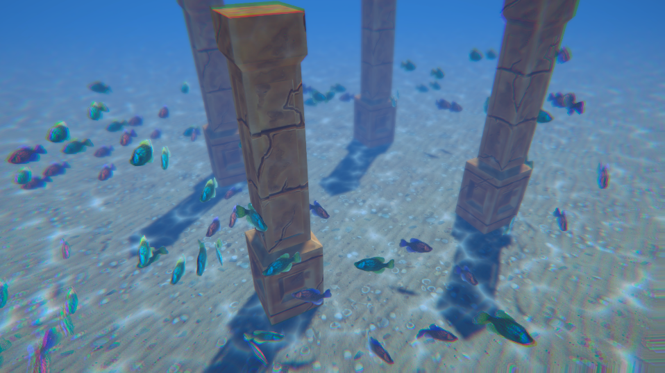

##FlockingAI - URP

This Unity (Universal Render Pipeline) 2019.3 project embellishes upon
learnings from the UnityLearn class "AI for Beginners", in particular the 
Flocking/Avoidance Crowd AI sections presented by Dr Penny de Byl @ [Holistic3d.com](https://holistic3d.com/)

This project looks at code that enables digital fish to swim around and environment, 
with AI code to allow them to flock in groups, avoid other fish and obstacles.

Cinemachine, Post Processing, and Shadergraph elements added for effect, with some
code experimentations with VolumeComponent (LensDistortion) to create a 'watery'
screen view.
Shadergraph shaders for textures to also create a 'caustic' light simulation.

This project utilizes the Stylized Sand Pillar, a FREE asset in the Unity Asset store.
https://assetstore.unity.com/packages/3d/props/exterior/stylize-sand-pillar-59604

